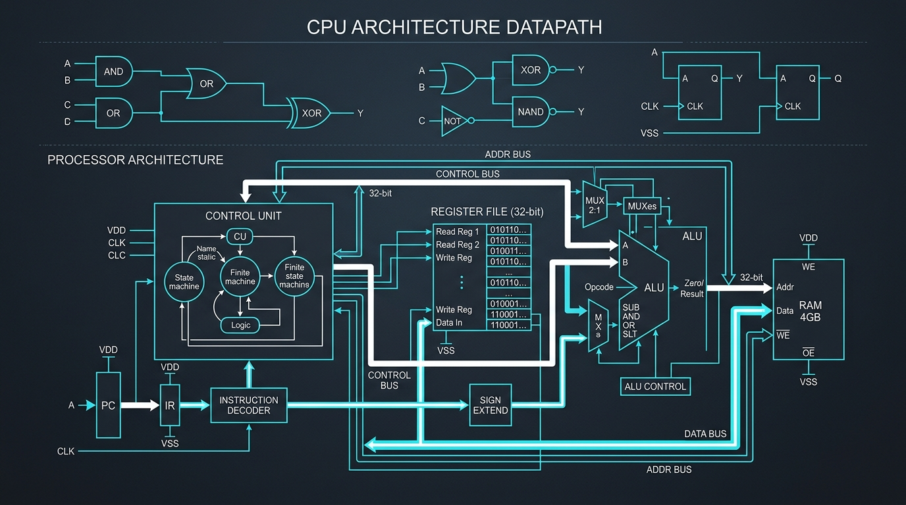
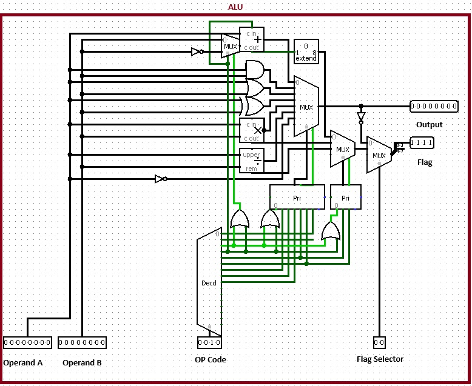
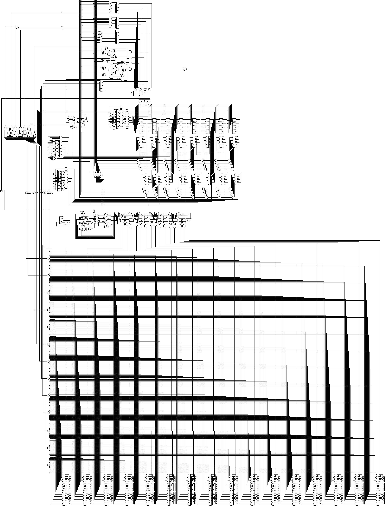

# Architecture Processeur & UAL (Logisim)



Conception, modélisation et simulation de circuits logiques numériques sous **[Logisim](http://www.cburch.com/logisim/)** : réalisation d'une **Unité Arithmétique et Logique (UAL / ALU) 8 bits** modulaire et d'une architecture de **processeur synchrone complet** avec jeu d'instructions (ISA) dédié.

Ce projet a été développé pour explorer les fondations matérielles des systèmes informatiques (*from logic gates to processor execution*). La maîtrise de ces briques élémentaires apporte une compréhension approfondie des mécanismes d'exécution bas niveau, directement valorisable dans l'analyse de performance et l'optimisation algorithmique.

---

## 📐 1. Unité Arithmétique et Logique 8 bits (ALU)

L'UAL implémentée prend en charge deux opérandes 8 bits (`Operand A`, `Operand B`) et exécute des opérations arithmétiques et logiques sélectionnées via un code opération (**Opcode**) sur 4 bits.



### Table des Opcodes de l'UAL

| Opcode (Binaire) | Mnémonique | Type | Description |
| :---: | :---: | :---: | :--- |
| `0000` | **NOP** | Contrôle | Aucune opération (No Operation) |
| `0001` | **HALT** | Contrôle | Arrêt de l'exécution |
| `0010` | **ADD** | Arithmétique | Addition ($A + B$) avec retenue |
| `0011` | **SUB** | Arithmétique | Soustraction ($A - B$) |
| `0100` | **MUL** | Arithmétique | Multiplication matérielle ($A \times B$) |
| `0101` | **DIV** | Arithmétique | Division entière ($A / B$) & calcul du reste |
| `0110` | **AND** | Logique | Opération logique ET bit à bit ($A \land B$) |
| `0111` | **OR** | Logique | Opération logique OU bit à bit ($A \lor B$) |
| `1000` | **XOR** | Logique | Opération logique OU exclusif ($A \oplus B$) |

### Caractéristiques du Circuit
- **Décodage** : Décodeur 4 bits vers lignes de commande.
- **Routage** : Multiplexeurs multi-voies associés à des encodeurs de priorité (*Priority Encoders*).
- **Indicateurs d'état (Flags)** : Détection de résultat nul (`Zero`), de dépassement de capacité (`Overflow`) et de retenue (`Carry`).
- **Fichier source** : [`Models/ALU/ALU8bits.circ`](Models/ALU/ALU8bits.circ).

---

## 🖥️ 2. Architecture CPU Complète (Gate-Level Design)

Conception intégrale au niveau des portes d'un processeur synchrone comprenant son banc de registres, son unité de contrôle, son décodage d'instructions et son bus d'interconnexion.



### Format d'Instruction Machine

Chaque instruction est codée sous un mot binaire structuré :

```text
+-------------------+--------------------+------------------------+--------------------+
|  Opcode (3 bits)  |  Dest Reg (3 bits) |  Src 1 / Imm (4 bits)  |  Src 2 Reg (3 bits)|
|     [12 : 10]     |      [9 : 7]       |        [6 : 3]         |      [2 : 0]       |
+-------------------+--------------------+------------------------+--------------------+
```

- **Bits [12:10] (3 bits)** : Opcode de l'instruction assembleur.
- **Bits [9:7] (3 bits)** : Adresse du registre de destination.
- **Bits [6:3] (4 bits)** : Valeur immédiate (ex. pour `LOAD`) ou adresse registre source 1 (3 bits).
- **Bits [2:0] (3 bits)** : Adresse du registre source 2.

### Jeu d'Instructions Assembleur (ISA)

| Code (3b) | Mnémonique | Syntaxe / Exemple | Description |
| :---: | :---: | :--- | :--- |
| `000` | `ADD` | `ADD R_dest, R_src1, R_src2` | Addition de deux registres |
| `001` | `LOAD` | `LOAD R_dest, #imm` | Chargement d'une valeur immédiate 4 bits |
| `010` | `SOUS` | `SOUS R_dest, R_src1, R_src2` | Soustraction de deux registres |
| `011` | `CMP` (`==`) | `CMP R_src1, R_src2` | Comparaison d'égalité et mise à jour des drapeaux |
| `100` | `AND` (`&&`) | `AND R_dest, R_src1, R_src2` | Opération logique ET |
| `101` | `OR` (`\|\|`) | `OR R_dest, R_src1, R_src2` | Opération logique OU |
| `110` | `JUMP` | `JUMP addr` | Saut inconditionnel vers une adresse |
| `111` | `JUMP_IF` | `JUMP_IF addr` | Saut conditionnel asservi aux drapeaux (Zero / Overflow) |

### Registres & Signaux d'État
- **Banc de registres** : Matrice séquentielle architecturée avec des bascules D (*D Flip-Flops*).
- **Flags matériels** :
  - `Flag 1` : **Zero** (activé si le résultat de l'opération vaut 0).
  - `Flag 2` : **Overflow** (activé lors d'un débordement arithmétique).
- **Fichier source** : [`Models/Olds/ALU.circ`](Models/Olds/ALU.circ).

---

## 🚀 Utilisation avec Logisim

1. Téléchargez et installez **Logisim** (ou **Logisim-evolution**).
2. Ouvrez le projet désiré :
   - UAL 8 bits : `File > Open > Models/ALU/ALU8bits.circ`
   - CPU V1 : `File > Open > Models/Olds/ALU.circ`
3. Activez l'horloge et la simulation (`Simulate > Ticks Enabled` / `Ctrl+K`) pour observer l'exécution pas-à-pas et la propagation des signaux sur les bus.

---

## 📄 Licence

Ce projet est sous licence MIT — voir le fichier [LICENSE](LICENSE) pour plus de détails.